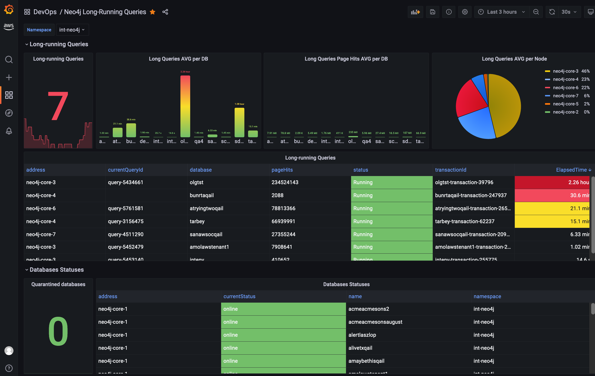

# Prometheus Neo4j Exporter
A comprehensive Prometheus exporter for Neo4j including database statuses, long-running queries, performance metrics, and cluster health monitoring.

## Features

- **Database Status Monitoring**: Track online/offline status of all databases in the cluster
- **Long-Running Query Detection**: Monitor queries running longer than 10 seconds with detailed transaction info
- **Transaction Metrics**: Active transaction counts and transaction ID tracking
- **Connection Monitoring**: Real-time Bolt connection statistics by connector type
- **Store Format Tracking**: Monitor database storage format versions
- **Page Cache Metrics**: Cache hit/fault statistics (Enterprise Edition only)
- **Cluster-Aware**: Supports both single-instance and multi-node Neo4j deployments
- **Enhanced Error Handling**: Detailed logging with stack traces for troubleshooting
- **Community Edition Compatible**: Works with Neo4j Community Edition out of the box

## Installation

### Docker

Start the container, specify the address of the Neo4j cluster in the NEO4J_SERVICE environment variable:

```bash
docker run --rm -itd --name neo4j_exporter \
  -p 9099:5000 \
  -e NEO4J_SERVICE=localhost \
  -e QUERY_TIMEOUT=30 \
  ghcr.io/petrov-e/neo4j_exporter:v1.0.0-5-g1e176d2
```

### Docker Compose

```bash
docker-compose up -d
```

The page with metrics in Prometheus format will be available here:
```bash
curl localhost:5000/metrics
```

View logs:
```bash
docker logs -f neo4j-exporter
```

## Configuration

### Environment Variables

| Variable | Description | Default | Required |
|----------|-------------|---------|----------|
| `NEO4J_SERVICE` | Hostname or IP address of Neo4j server | - | Yes |
| `QUERY_TIMEOUT` | Timeout for Neo4j queries in seconds | 30 | No |
| `FLASK_DEBUG` | Enable Flask debug mode | 0 | No |
| `PYTHONUNBUFFERED` | Unbuffered Python output | 1 | No |

### Authentication

The current version connects to Neo4j without authentication (`auth=None`). If your Neo4j instance requires authentication, modify the connection string in `src/app.py`.


## Exported Metrics

### Database Status Metrics

| Metric Name | Type | Description | Labels |
|-------------|------|-------------|--------|
| `neo4j_db_status` | Gauge | Database status (1=online, 0=other) | `name`, `address`, `currentStatus`, `namespace` |

### Long-Running Query Metrics

| Metric Name | Type | Description | Labels |
|-------------|------|-------------|--------|
| `neo4j_db_slow_query` | Gauge | Elapsed time in ms for queries >10s | `database`, `transactionId`, `currentQueryId`, `status`, `activeLockCount`, `pageHits`, `cpuTimeMillis`, `waitTimeMillis`, `idleTimeSeconds`, `namespace`, `address` |
| `neo4j_db_slow_query_page_hits` | Gauge | Page hits for slow queries | `database`, `transactionId`, `currentQueryId`, `status`, `activeLockCount`, `cpuTimeMillis`, `waitTimeMillis`, `idleTimeSeconds`, `namespace`, `address` |

### Transaction Metrics

| Metric Name | Type | Description | Labels |
|-------------|------|-------------|--------|
| `neo4j_transaction_active` | Gauge | Number of currently active transactions | `database`, `namespace` |
| `neo4j_transaction_last_id` | Gauge | Last transaction ID observed | `database`, `namespace` |

### Connection Metrics

| Metric Name | Type | Description | Labels |
|-------------|------|-------------|--------|
| `neo4j_bolt_connections_active` | Gauge | Active Bolt connections by connector type | `connector`, `namespace` |
| `neo4j_bolt_connections_total` | Gauge | Total number of Bolt connections | `namespace` |

### Store Format Metrics

| Metric Name | Type | Description | Labels |
|-------------|------|-------------|--------|
| `neo4j_store_format` | Gauge | Database store format version (always 1) | `database`, `format`, `namespace` |

### Page Cache Metrics (Enterprise Edition Only)

These metrics require JMX access and are typically only available in Neo4j Enterprise Edition:

| Metric Name | Type | Description | Labels |
|-------------|------|-------------|--------|
| `neo4j_page_cache_hits` | Gauge | Total page cache hits | `database`, `namespace` |
| `neo4j_page_cache_faults` | Gauge | Total page cache faults (misses) | `database`, `namespace` |
| `neo4j_page_cache_hit_ratio` | Gauge | Page cache hit ratio (0-1) | `database`, `namespace` |

**Note:** Page cache metrics will be empty for Neo4j Community Edition as they require JMX monitoring capabilities.

## How It Works

1. **Background Collection**: Metrics are collected every 240 seconds (4 minutes) in a background thread
2. **Process Isolation**: Each Neo4j query runs in a separate process with configurable timeout
3. **Cluster Discovery**: The exporter can discover cluster nodes via:
   - Primary service URL (`NEO4J_SERVICE` environment variable)
   - Environment variables (`NEO4J_CORE_*`, `NEO4J_REPLICA_*`) for individual nodes
4. **Kubernetes Support**: Auto-detects pod namespace from service account when running in Kubernetes

## Troubleshooting

### Common Issues

1. **Connection Timeout**: If queries are timing out, increase `QUERY_TIMEOUT` environment variable
2. **No Metrics**: Check that `NEO4J_SERVICE` points to the correct Neo4j instance
3. **Authentication Errors**: Verify that Neo4j is configured with `NEO4J_AUTH=none` or update the exporter code to use credentials
4. **Empty Metrics**: Wait 60 seconds after startup for the first metric collection to complete

### Viewing Logs

Check logs for detailed error messages with stack traces:
```bash
docker logs -f neo4j-exporter
```

### Testing Connection

Verify Neo4j is accessible:
```bash
docker exec -it neo4j cypher-shell -a bolt://localhost:7687 "RETURN 1"
```

# Grafana Dashboard for Prometheus Neo4j Exporter

To import the Grafana dashboard:

1. Copy dashboard JSON text from: [neo4j-long-running-queries.json](grafana-dashboard/neo4j-long-running-queries.json) 
2. On the create tab, select Import.
3. Paste dashboard JSON text directly into the text area and click Load.
4. Select the Data Source as Prometheus and click Import.



